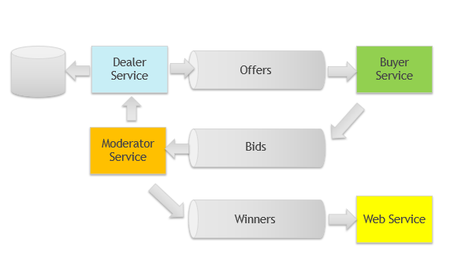

# Bidding Service

Training project for microservices using:
- Spring
- Kafka
- Containerization 

### Roles and Items 
- Dealer
- Buyer
- Moderator
- Offer
- Bid

### Use cases

##### 1 Casino
- Dealer starts a playing session
- Player makes a bet
- Moderator decides who is the winner

##### 2 Auction
- Seller issues an offer
- Buyer makes a bid
- Auctioneer/AuctionManager decides who is the winner

##### 3 Intellectual game
- Dealer issues a question
- Player sends an answer
- Moderator decides who is the winner

