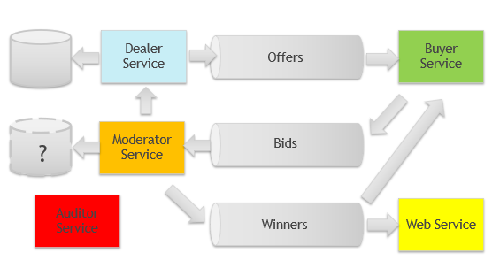

# Bidding Service

Training project for microservices using:
- Spring
- Kafka
- Containerization 

### Roles and Items 
#### Roles
- __Dealer__ issues offers and keeps secret value 
- __Buyer__ makes bids
- __Moderator__ defines the winner(s) on the base of the secret value and bidding rules
- __Auditor/Admin__ makes audit of the logs 

#### Items
- __Offer__ it's an event {offerId, timestamp, expirationTime, price, textDescription}
- __SecretValue__ it's a correct answer for a given offer (or a number to guess)
- __Bid__ it's an event {bidId, buyerId, offerId, stake, guessValue}

- __Winner__ maybe we need separate winner event {bidId, offerId, buyerId, isWinner} or just a field isWinner in a Bid

### Use cases

##### 1 Casino
- Dealer starts a playing session (offer event)
- Player makes a bet
- Moderator decides who is the winner(s)

##### 2 Auction
- Seller (dealer) issues an offer
- Buyer makes a bid
- Auctioneer/AuctionManager decides who is the winner(s)

##### 3 Intellectual game
- Dealer issues a question
- Player sends an answer
- Moderator decides who is the winner(s)

### User Stories

- As a Buyer I want to log up or login in BIDDING service
- As a Buyer I want to see current offers and make a bid for the offer of my choice
- As a Buyer I want to see the current result of the bidding and the overall total result

- As a Dealer I want to issue an offer plus secret value for bidding rules and keep the record of all offers

- As a Moderator I want to see all the bids and the corresponding secret values, check the bids against bidding rules
- As a Moderator I want to calculate the total number of bids for a given offer, calculet the number of winners
- As a Moderator I want to calculate the shares and assign them to the winners
- As a Moderator I want to notify all the buyers and keep the record of the results

- As an Auditor I want to check all the events, offers, and bids in the timeline for at least 2 weeks 

